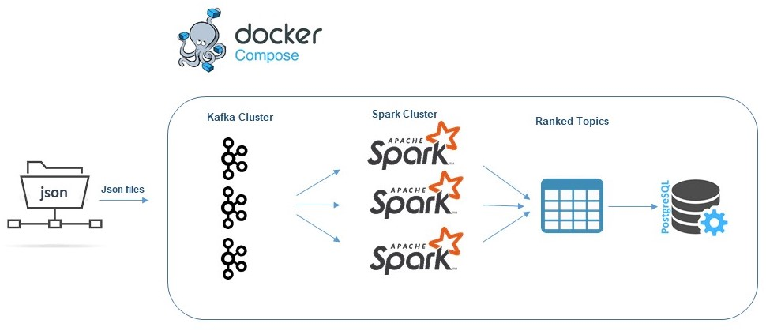
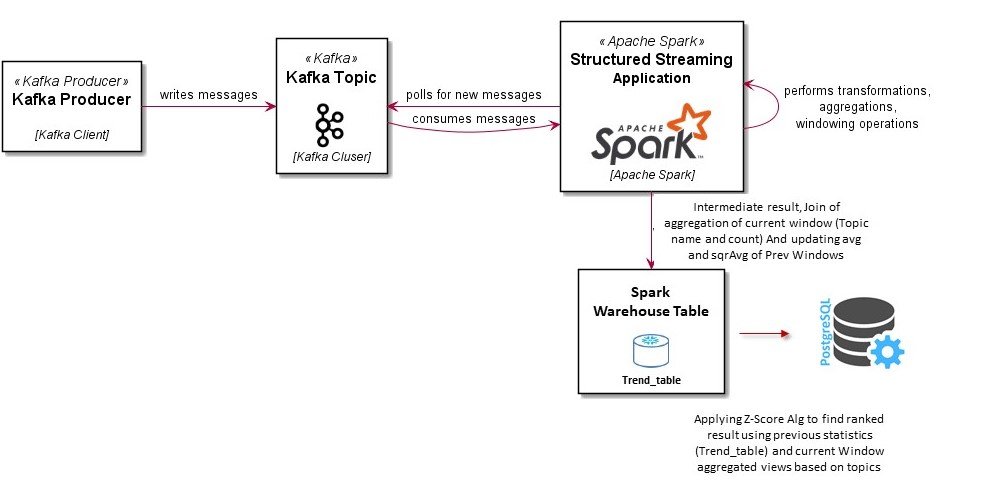

# Finding Hot Topic - Spark Streaming, Scala and Kafka

## Context
Which Meetups should we go to?
We have a sample json file containing a single RSVP 'message' per line. With the huge amount of meetups taking place on a daily basis, it can be hard to keep up with hot topics. In this project we build a distributable solution to discover trending topics in data from Meetup.


## Datasets

Each row in the data set will be like:


```json
{
  "venue": {
    "venue_name": "Brisbane Workers\u2019 Community Centre",
    "lon": 153.002182,
    "lat": -27.46052,
    "venue_id": 17770652
  },
  "visibility": "public",
  "response": "no",
  "guests": 0,
  "member": {
    "member_id": 221294483,
    "photo": "http:\/\/photos1.meetupstatic.com\/photos\/member\/e\/8\/0\/4\/thumb_263939396.jpeg",
    "member_name": "Jenny Lethbridge"
  },
  "rsvp_id": 1658874890,
  "mtime": 1489923634000,
  "event": {
    "event_name": "Guest Presenter: Valerie Perret - Wellness facilitator and Self-Care Afficionado",
    "event_id": "238486635",
    "time": 1491525000000,
    "event_url": "https:\/\/www.meetup.com\/DreamBuilders-Brisbane\/events\/238486635\/"
  },
  "group": {
    "group_topics": [
      {
        "urlkey": "metaphysics",
        "topic_name": "Metaphysics"
      },
      {
        "urlkey": "consciousness",
        "topic_name": "Consciousness"
      },
      {
        "urlkey": "lifetransform",
        "topic_name": "Life Transformation"
      },
      {
        "urlkey": "self-esteem-self-confidence-boundaries-limits",
        "topic_name": "Self Esteem Self Confidence Boundaries & Limits"
      },
      {
        "urlkey": "self-help-self-improvement",
        "topic_name": "Self Help & Self Improvement"
      }
    ],
    "group_city": "Brisbane",
    "group_country": "au",
    "group_id": 19966923,
    "group_name": "Expand Your Awareness & Unlock Your Dreams   Brisbane",
    "group_lon": 153.02,
    "group_urlname": "DreamBuilders-Brisbane",
    "group_lat": -27.46
  }
}
```


## Requirements

This is a **distributable** solution that can take a Meetup RSVP data on input, and outputs an ordered list of the top trending topics per day. trending define as the largest *rate* increase of occurrence during a particular time period. Trends quantify the *rate* of growth over a specified period over different time points. A growth trend can be measured over any period of time, such as a minute, hour or day.


# Solution
## Description
This is an End-to-End Structured Streaming solution from reading data from kafka server to processing and applying transformation to each microbatch and storing the final result in a postgres database.
To do this, various programming language and tools have been used, which are explained below. Also, docker has been used to simulate the operating environment.


## Solution Architecture
To implement this code challenge, the following architecture is used, which the responsibility and the reason for use for each processing unit are described below.

<p align="center">
  
</p>

### Apache Kafka
Apache Kafka is very popular, simple, scalable, efficient, mature and stable. 

It is very important to be able to create queues in online processing systems to process events based on priorities. There are other choices for this, such as Redis and RabbitMQ. 


### Apache Spark

The solution starts from reading the json file from kafka mounted directory line by line using a bash script and writing data to a kafka topic. Next, spark structured streming starts by opening a window on the kafka topic and reading all the json records until the end of window duration. after that all the required information will be extracted from json records and data will be stored in a microbatch dataframe. In Spark, a DataFrame is a distributed collection of data organized into named columns. It is conceptually equivalent to a table in a relational database. this microbatch  
will be aggregated on topic count and will be passed to writeStream class for futher compution of trend ranking algorithm.
the pseudocode for ranking algorithm which is based on z-score is as follow:

### Ranking Algorithm (modified Z-Score)

>**if** this is first batch to be processed in kafka:  
>&nbsp;&nbsp;&nbsp;&nbsp;**avg** = topic_count and sqrAvg=topic_count <sup>2</sup> for each row in the microbatch DF;  
>&nbsp;&nbsp;&nbsp;&nbsp;save MicroBatch df in **TrendTable** in Spark warehouse;  
>**else**  
>&nbsp;&nbsp;&nbsp;&nbsp;retrieve **trend_table** from DB;  
>&nbsp;&nbsp;&nbsp;&nbsp;full outer join **trend_table** and **microbatchDF**  
>&nbsp;&nbsp;&nbsp;&nbsp;update avg and sqrAvg in trend_table based on new observation in microbatchDF:  
>&nbsp;&nbsp;&nbsp;&nbsp;&nbsp;&nbsp;&nbsp;&nbsp;**avg** = avg * decay + topic_count * (1 - decay)  
>&nbsp;&nbsp;&nbsp;&nbsp;&nbsp;&nbsp;&nbsp;&nbsp;**sqrAvg** = sqrAvg * decay + (topic_count <sup>2</sup>) * (1 - decay)  
>&nbsp;&nbsp;&nbsp;&nbsp;&nbsp;&nbsp;&nbsp;&nbsp;Overwrite **new trend_table** based on new avg and sqrAvg in DB;  
>&nbsp;&nbsp;&nbsp;&nbsp;compute **trendDF** based on new avg and sqrAvg and topic observation:  
>&nbsp;&nbsp;&nbsp;&nbsp;&nbsp;&nbsp;&nbsp;&nbsp;**topic_score** = (obs - avg) / std();  
>&nbsp;&nbsp;&nbsp;&nbsp;&nbsp;&nbsp;&nbsp;&nbsp;compute final ranked df based on each topic score and store the result in postgres Sql;  

<p align="center">
  
</p>


### Docker

Docker is always a good choice for preparing the development 
environment and quickly implementing the software architecture and prototyping.

## Version Compatibility

Scala| Spark|sbt     
--- | --- | ---
2.11.12| 2.4.0| 1.3.13

## Getting Started

This section explains how to run this App. I have tried to make it very simple. 

### Prerequisites
The required prerequisites are:

* Docker and docker-compose 3
* Internet connection to download required docker images and libraries.

### Installation

Follow the steps below to run the App. put the json files in `kafka/resources` directory. this directory from localhost is mounted to docker kafka server.

running all containers
   ```sh
   $ sudo docker-compose up -d
   ```

After processing of 2 microbatch is finished (the required time for processing each microbatch depends on window.duration parameter in config file that can be configured. I should mention that the 2 parameter window.duration and trigger.processingTime should have the same value based on second, minute and hour), the data will be inserted to postgres data base and can be accessed with any postgres sql client like psql as follow:
   ```sh
   $ psql -h localhost -p 5432 -U postgres
   ```
Password for user postgres: postgres.
change the default database to brgroup:
   ```sh
   $ \c brgroup;
   ```
and select from final resalt table BRGROUP.TREND_TABLE.

## Stoping Services
Enter the following command to stop the containers:

```bash
$ sudo docker-compose down -v
```

## Build from source
Enter the following command to build from source. SBT must be installed on the system.

```bash
$ sbt assembly publish
```
The jar file will be created in the ```spark/topic_trend/topic_trend_2.11/0.1/topic_trend_2.11-0.1-assembly.jar``` directory.


## Author

👤 **Hadi Ezatpanah**

- Github: [@hadiezatpanah](https://github.com/hadiezatpanah)

## Version History
* 0.1
    * Initial Release
